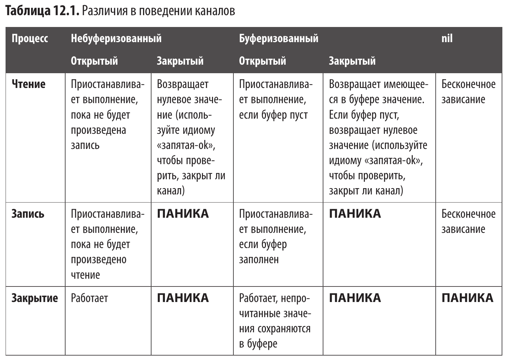

Модель конкурентности языка Go основана на теории взаимодействующих последовательных процессов (Communicating Sequential Processes, CSP).

Применяйте конку­рентность лишь в том случае, когда она делает вашу программу лучше.

**Конкурентность** — это не **параллелизм**.

Будет или нет конкурентный код выполняться параллельно (одновременно), за­висит от используемого аппаратного обеспечения и от того, позволяет ли это алго­ритм.

Процесс выполнения любой программы можно разделить на три этапа: *получение данных*, их *преобразование* и *вывод результата*. Ответ на вопрос, следует или нет использовать в программе конку­
рентность, зависит от того, как движутся данные в программе по мере выпол­нения этих этапов. Иногда два этапа могут выполняться конкурентно, потому что результаты одного этапа не требуются для выполнения другого, а иногда два этапа должны выполняться последовательно, потому что результаты одного этапа необходимы для выполнения другого. Применяйте конкурентность, когда
требуется объединить результаты нескольких операций, которые могут выпол­няться независимо друг от друга.

Конкурентность не стоит использовать в тех случаях, когда выполнение процессов не занимает много времени. Помните о том, что конкурентность несет за собой определенные издержки. Многие реализации
известных алгоритмов, работающих в памяти, выполняются настолько быстро, что накладные расходы на передачу значений посредством конкурентности пере­вешивают любую потенциальную экономию за счет параллельного выполнения конкурентного кода. Именно поэтому конкурентность часто используется при выполнении операций ввода-вывода: операции чтения или записи на диск или в сеть работают в тысячи раз медленнее операций с памятью, кроме самых слож­ных. 

**Процесс** — это экземпляр программы, выполняемой опера­ционной системой компьютера.  Операционная система связывает с процессом такие ресурсы, как память, и следит за тем, чтобы другие процессы не могли их (те ресурсы) использовать. Процесс состоит из одного или нескольких потоков. **Поток** — это единица выполнения, на работу которой операционная система дает некоторое время. Потоки одного процесса совместно используют его ресурсы (те память). Центральный процессор может выполнять инструкции из одного или нескольких потоков одно­временно в зависимости от количества имеющихся у него ядер. Одной из задач операционной системы является планирование выполнения потоков процессором таким образом, чтобы были выполнены каждый процесс и каждый его поток.

**Горутины** — ключевая концепция модели конкурентности языка Go.
*Горутины* — это легковесные потоки, которыми распоряжается среда выполнения языка Go. При запуске Go-программы среда выполнения языка Go создает для нее несколько потоков и запускает одну горутину. Все создаваемые go-программой горутины, включая самую первую, автоматически закрепляются за этими пото­ками планировщиком среды выполнения языка Go.

Функция **main** сама выполняется в горутине, которая запуска­ется средой выполнения языка Go при запуске программы.

Преимущества использования горутин:
1. Создание горутины занимает меньше времени, чем создание потока, поскольку при этом не создается системный ресурс.
2. Исходный размер стека горутин (2 KB) меньше размера стека потоков и может увели­чиваться/уменьшаться по мере необходимости. Это делает горутины более эффективными в плане использования памяти.
3. Переключение между горутинами занимает меньше времени, чем переключе­ние между потоками, поскольку осуществляется полностью внутри процесса, без обращений к сравнительно медленным системным вызовам.
4. Являясь составной частью процесса, планировщик может оптимизировать свои решения. Взаимодействуя с механизмом опроса сетевых соединений, планировщик выявляет горутины, заблокированные в операции ввода-вывода, и не планирует их на выполнение. Он также взаимодействует со сборщиком мусора и следит за тем, чтобы работа была равномерно распределена между потоками операционной системы, выделенными для вашего Go-процесса.

Эти преимущества позволяют Go-программам создавать сотни, тысячи и даже десятки тысяч одновременных горутин. 

Горутине можно передать параметры для инициали­зации ее состояния, но ее возвращаемые значения будут игнорироваться.
Горутины принято запускать с помощью замыкания.
Горутины общаются друг с другом посредством каналов. каналы представляют собой ссылочный тип. Когда вы передаете канал функции, ей в действительности передается указатель на канал. Нулевым значением для каналов является значение nil. Значение, записанное в канал, можно прочитать только один раз. Если данные из канала читают несколько горутин, то записанное в него значение прочитает
только одна из них.

По умолчанию каналы являются небуферизованными. После каждой операции записи в открытый небуферизованный канал пишущая горутина приостанав­ливается (те даже не выполняет свой код, который следует после отправки), пока другая горутина не прочитает данные из этого канала. Точно так же после каждой операции чтения из открытого небуферизованного канала читающая горутина приостанавливается, пока другая горутина не запишет новое значение в него. При использовании небуферизованного канала требуются как минимум две параллельно работающие горутины.
Буферизованные каналы, которые буферизуют без блокировки некоторое ограниченное количество операций записи. Если буфер заполнится до выполнения каких-либо операций чтения из канала, то следую­
щая операция записи в этот канал приостановит записывающую горутину, пока не будет произведено чтение из канала. Точно так же попытка чтения из канала с пустым буфером приостановит читающую горутину.

Встроенные функции **len** и **cap** возвращают информацию о буферизованном канале. С помощью функции len можно узнать текущее количество значений в буфере, с помощью cap — максимальный размер буфера, или его емкость. Емкость буфера нельзя изменить. При передаче небуферизованного канала функции len и cap возвращают 0. логично, тк нет буфера.

Для чтения из канала можно задействовать цикл for-range:
``` go
for v := range ch {
  fmt.Println(v)
}
```
В отличие от других вариантов использования цикла for-range, в данном случае для канала объявляется только одна переменная, представляющая содержащиеся в нем значения. Если канал открыт и в нем доступно значение, оно присваивается переменной v и затем выполняется тело цикла. Если в канале нет значения, то горутина приостанавливается, пока значение не станет доступным или канал
не будет закрыт. Выполнение цикла продолжается до тех пор, пока канал не будет закрыт или не будет встречен оператор break или return.

После завершения записи в канал его следует закрыть вызовом встроенной функции close:
``` go
  close(ch)
```
После закрытия канала любые попытки произвести в него запись или закрыть его снова приведут к панике. Однако, что интересно, попытки чтения из закрытого канала всегда завершаются успехом. Если канал буферизованный и в буфере остаются непрочитанные значения, то они будут возвращены в том же порядке, в каком были записаны. Если канал небуферизованный или буферизованный, но
с пустым буфером, то операция чтения вернет нулевое значение, соответствующее типу канала (например 0 для int, или false для bool).

Использование идиомы «запятая-ok» для проверки того, закрыт канал или нет:
``` go
v, ok := <-ch
```
Если переменная ok получит значение true, значит, канал открыт. Если пере­менная ok получит значение false — закрыт. Производя чтение из канала, который может оказаться закрытым, всегда
используйте идиому «запятая-ok», чтобы убедиться в том, что канал еще открыт.
Задача закрытия канала возлагается на горутину, которая пишет в канал.

Поскольку каналы — всего лишь одна из разновидностей переменных, среда выполнения языка Go может выявлять неиспользуемые каналы и удалять их путем сборки мусора.


Оператор **select** - позволяет изящно решить, какую из двух конкурентных опера­ций выполнить первой, когда нельзя сделать какую-либо из них более приоритет­ной, чтобы избежать проблемы невыполнения некоторых операций. Проблема, когда какие-то операции не выполняются, потому что постоянно предпочтение отдается более приоритетным операциям, называется голоданием.
Оператор select позволяет горутине произвести чтение или запись в один из нескольких каналов (при готовности нескольких ветвей case - выбор происходит случайным образом). Оператор select может иметь ветвь default эта ветвь выбирается, когда ни с одним из каналов, указанных в ветвях case, не могут быть выполнены операции чтения или записи.

Конкурентности не должно было в API. Это позволяет вносить изменения в работу кода, не изменяя способа его вызова. никогда не следует раскрывать применение каналов или мьютексов  в сигнатурах функций и методов
API. Вынуждая пользователей вашего API передавать или принимать каналы, вы тем самым возлагаете на них ответственность за управление каналами. Это значит, что пользователям придется побеспокоиться о буферизации каналов, их закрытии и правильной обработке каналов nil . Они также могут вызвать состояние взаимоблокировки, попытавшись выполнить доступ к каналам или мьютексам в неожиданном порядке. Они не должны быть экспортируемыми. У этого правила есть исключения. Каналы могут входить в состав API, если речь идет о библиотеке, содержащей вспомогательную функцию для работы с конку­рентностью.

Каждый раз, когда замыкание зависит от переменной, значение которой может измениться независимо от того, используется ли оно в горутине, явно передавайте значение в замыкание или создавайте уникальную копию переменной для каждого замы­кания, которое ссылается на нее.
``` go
go func(val int) {
  _ = val
}(v)
```
Предусматривая запуск горутин, предусматривайте и их завершение. В отличие от переменных, среда выполнения языка Go не может проверить, будет ли еще приме­няться та или иная горутина. Если горутину не закрыть, то планировщик продолжит выделять ей время, которое она не будет использовать, что негативно скажется на производительности программы. Эта проблема называется *утечкой горутин*.
В общем случае выходить из горутины следует после того, как будут использованы все значения. Однако, если выйти из цикла слишком рано, то горутина заблокиру­ ется и будет бесконечно ждать, когда из канала будет прочитано еще одно значение:
``` go
func countTo(max int) <-chan int {
	ch := make(chan int)
	go func() {
		for i := 0; i < max; i++ {
			ch <- i // ожидание тут
		}
		close(ch)
	}()
	return ch
}

func main() {
	for i := range countTo(10) {
		if i > 5 { // горутина так и продолжает ждать прочтение остальных значений...
			break
		}
		fmt.Println(i)
	}
}
```

Использование контекста для завершения горутин:
``` go
func countTo(ctx context.Context, max int) <-chan int {
	ch := make(chan int)
	go func() {
		defer close(ch)
		for i := 0; i < max; i++ {
			select {
			case <-ctx.Done():
				return
			case ch <- i:
			}
		}
	}()
	return ch
}

func main() {
	ctx, cancel := context.WithCancel(context.Background())
	defer cancel()
	ch := countTo(ctx, 10)
	for i := range ch {
		if i > 5 {
			break
		}
		fmt.Println(i)
	}
}
```
Буферизованные каналы следует использовать, когда вы знаете количество запущенных горутин и хотите ограничить количество горутин, которые еще будут запущены, или ограничить объем работы, стоящей в очереди на выполнение. Буферизованные каналы отлично работают, когда нужно либо собрать данные из некоторого набора запущенных горутин, либо ограничить конкурентное ис­пользование. Их можно применять также для управления объемом работы, по­ставленной системой в очередь на выполнение, чтобы не допустить снижения производительности и перегрузки ваших сервисов.

С помощью буферизованного канала можно также реализовать такой прием, как противодавление. система работает в целом лучше, когда ее компоненты ограничивают объем выполняемой ими работы. Мы можем ограничить количество одновременных запросов в системе:
``` go
type PressureGauge struct{
	ch chan struct{}
}

func New(limit int) *PressureGauge{
	return &PressureGauge{
		ch: make(chan struct{}, limit)
	}
}

func (pg *PressureGauge) Process(f func()) error {
	select {
	case pg.ch <- struct{}{}:
		f()
		<-pg.ch
		return nil
	default:
		return errors.New("no more capacity")
	}
}
```


